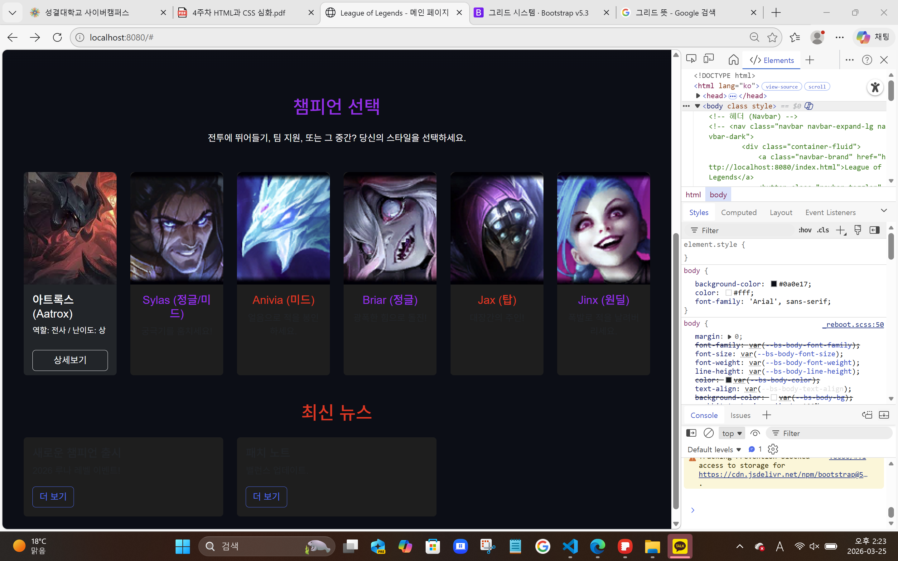
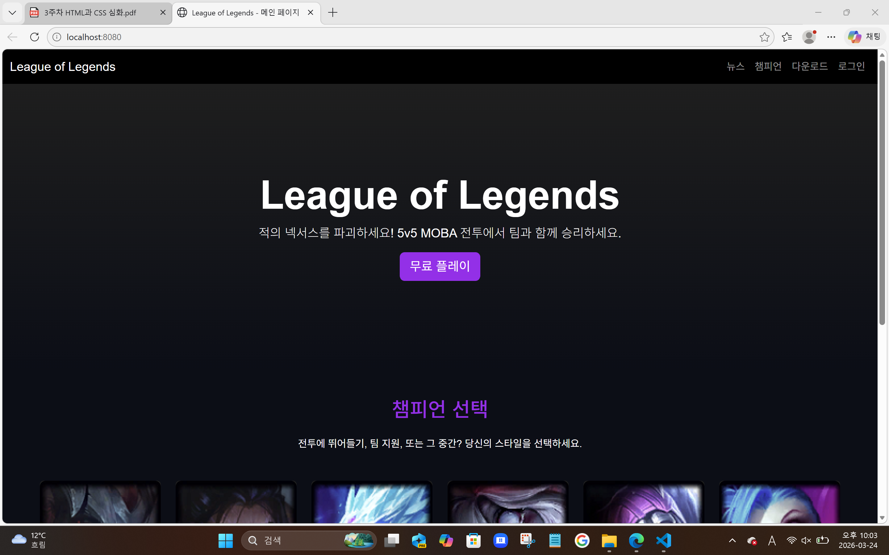

# code-with-quarkus
## Running the application in dev mode

You can run your application in dev mode that enables live coding using:

```shell script
./mvnw quarkus:dev

# quarkus프로젝트시작! (학번: 20250099 이름: 안홍진 )
매주수업내용을정리하자.
## 2주차수업내용
실습1 : 쿼크스환경구축및준비완료!
실습2 : HTML 기본및LOL 메인화면개발완료!
<divalign="center">


</div>
<br>
## 3주차수업내용
테스트

c:\Users\limeb\OneDrive\바탕 화면\자바 웹 프로그래밍\화면 캡처 2026-03-24 220401.png

"C:\Users\limeb\OneDrive\바탕 화면\자바 웹 프로그래밍\화면 캡처 2026-03-24 220401.png"


"C:\code-with-quarkus\screenshots\화면 캡처 2026-03-24 220401.png"



#4주차 수업내용
#네비게이션 버튼 그리드 모달창


### 밑의 내용은 메일에 첨부된 pdf파일에 더 제대로 적혀있습니다. ###


*저번주에 까먹고 전출안해서 결석뜸. 교수님께 부탁드려보기.

자바25jdk다운

Quarks 다운, 


한글

코리안 랭귀지 팩 다운

Extension pack for java?

*설정에서 java home 검색하면 settings.json에서 편집 이라는 파란글씨 뜨고 클릭하고 빈 경로에 java jdk 25.0.2 경로 붙여넣기 하고 빨갛게 뜬 곳에 \이거 삭제하고 // 이거 써주면 됨. 경로는 //

*다운받으면 앵강하면 program file 폴더에 있을가능성 높음..

*w로 홈페이지
*아무개 구글계정에 백업있음
*

*head 뭐시기무ㅗ시기 head 이런식으로 방을 만들고 안에 내용이 앞 글자? 를 수식

--3주차(실질2주차)--

*개발전용 ai를 사용하면 ai가 내 내/외부 영역파일 접근해서 동시에 여러개의 프로젝트를 만듦. 하나 써보길 추천하심.

***웹 시작 : ./mvnw quarkus:dev

*명령어는 한번만 쳤었으면 파일 다시 켜도 십자키 위 눌러서 다시 불러올수있음.

*head 안에는 타이틀(제목만). body 안에 대부분이있ㄷ음
두번쨰 ppt 19페이지 참조 
h1은 폰트 사이즈
<p>이거도 폰트 지정
*

--------------
<!DOCTYPE html>
<html lang="ko">
<head>
<meta charset="UTF-8">
<meta name="viewport" content="width=device-width, initial-scale=1.0">
<title>QuarkusHello World</title>
</head>
<body>
<div class="container">
<h1>Hello, Quarkus!</h1>
<p>이파일은<code>META-INF/resources/index.html</code>에서실행중입니다.</p>
</div>
</body>
</html>

-----------

*ul 라는 코드는 리스트를 표기함. *이랑 비슷한 쩜이 맨 앞에 옴.

*div 라는 코드는 그룹으로 묶을때사용함. 덩어리

*nav라는 코드는 네비게이션 바(인터넷 화면 상단에 누르면 사이트 겨지는 버튼). nav로시작하고끝나면네이게이션 바임.

*bootstrap 사이트

*<style> 코드는 디자인 변경
h1코드는 디자인 셀렉터.

*hover 라는 코드는 웹사이트 실행했을떄 마우스를 올리면 움직이는 효과. 호버 밑에있는 코드들로 효과를 세세히 조절가능.

*대부분 웹사이트는  코드 거의 동일한데 바디 안에만 거의 조절

*
---------------------
<!DOCTYPE html>
<html lang="ko">
<head>
<link href="https://cdn.jsdelivr.net/npm/bootstrap@5.3.0/dist/css/bootstrap.min.css" rel="stylesheet">
    <style>
body { background-color: #0a0e17; color: #fff; }
.accent-purple { color: #a020f0; }
.card { background-color: #1e1e1e; border: none; color: white; }
.btn-primary { background-color: #a020f0; border: none; }
    
    /* 4단계: 애니메이션 및 시각 효과추가*/
    .card {
transition: transform 0.3s, box-shadow 0.3s;
}
.card:hover {
transform: scale(1.05); /* 마우스를 올리면 커짐 */
box-shadow: 0 10px 20px rgba(160, 32, 240, 0.5); /* 보라색 광원 효과 */
}
.card-img-top {
height: 200px;
object-fit: cover; /* 이미지가 찌그러지지 않게 채움 */
}
    
    </style>
</head>
<body>
<nav class="navbar navbar-expand-lg navbar-dark bg-dark">
<div class="container-fluid"><a class="navbar-brand" href="#">League of Legends</a></div>
</nav>
<div class="container my-5">
<div class="row">
<div class="col-md-4">
<div class="card">
<imgsrc="https://ddragon.leagueoflegends.com/cdn/15.24.1/img/champion/Aatrox.png" class="card-img-top">
<div class="card-body">
<h5>Aatrox</h5>
<p>어둠의검으로적을베세요.</p>
</div>
<h2 class="text-center accent-purple">챔피언 선택</h2>
</div>
</div>
</div>
</div>
</body>
</html>


-------------------

**GitHub 는 공유 드라이브 비슷한거임. 개발관련 편의기능이 많은듯.

*오늘 배운것: 웹사이트 코드 기본 틀 어디를 어떻게 수정하는지, github 다운

*스스로 하는 과제: 3주차 수업파일 마지막에 readme.md 에 약간 일기 쓰는것처럼 스샷이랑 이것저것 써서 기록남길 수 있으니 그거 한번 해보고 화면에 제대로 뜨는거 확인하라고 하심. 

*질문: readme에 넣은 사진이 github에서 안보이는데 이유를 모르겠음ㄴ


***4주차(3번쨰수업)
./mvnw quarkus:dev

*일반 사용자에게 서비스 할때는 무조건 80포트 로 등록해서 쓴다고 함.

*BOOTSTRAP 사이트 사용하는 이유: 반응형이라 기기에 따라 양식을 자동으로 바꿔주기 때문.

* <!-- Bootstrap 5 CDN -->
    <link href="https://cdn.jsdelivr.net/npm/bootstrap@5.3.0/dist/css/bootstrap.min.css" rel="stylesheet">
    <script src="https://cdn.jsdelivr.net/npm/bootstrap@5.3.0/dist/js/bootstrap.bundle.min.js"></script>

index.html에 보면 있는 코드인데 이게 뭘 하든 필수라는듯? 부트스트랩 참조 뭐시기


 <meta name="viewport" content="width=device-width, initial-scale=1.0">
이거도

*href 는 하이퍼링크. 클릭했을때 다른 캡 키는거

*<li class="nav-item"><a class="nav-link" href="#">외부웹사이트</a></li>
이걸로 내비게이션 바 추가

*엥간하면 쌍따음표로 묶기
target="_blank" 위에거에 이걸로 클릭시 새로운 탭으로 열게함.
*img src
로 이미지 

*이미지를 같은 리소스 폴더 안에 넣으면 맨 앞 글자만 입력해도 폴더랑 이미지 이름을 바로 제안해줌.


 
 

이건 상대경로 방식. 근데 많은 이미지를 관리할때는 절대 경로로 하는게 낫다고 함. 이미지를 변수로 전역변수로 만들어놨다가 쓰는거?

상대경로 : ./ or ../
절대 경로: http(https) or /


부트스트랩 안쓰고 하나하나 디자인 정해줄 순 있는데 스파게티 코드마냥 매우 불편함.

hr이 네비게이션에 줄긋는 태그

li ~~~~~ li가 네비게이션에 칸 하나임.

*부트스트랩 사이트에서 괜찮은 양식 골라서 코드 붙여넣기 한 다음에 거기서 일부 강조된 글씨들 바꾸면 출력되는 글씨만 싹 고칠 수 있음. 참고로 href 뒤에 오는 #을 수정하면 클릭시 어떤 사이트로 이동할지 정할 수 있음.

 

*새로 만든 네비게이션 바 코드 붙여넣은것 윗쪽에 보면 

<nav class="navbar navbar-expand-lg bg-body-tertiary">
이게 있는데 여기서 새로운 색상 data-bs-theme="dark" 같은걸로 bg-body-tertiary" 를 대체해주면 색이 바뀜.

근데 " 이거 쓰는 기준을 모르겠음. 일단 ㅇㅋ

* **과제 : 마무리 & 과제 • 추가 구현하기 • 상단좌측이미지 • 네비바 안에 LOL 로고 삽입 • 네비바가운데정렬 • UL 목록 속성 수정 • 챔피온카드 • 2025년 이후 출시된 신규 챔피온 • 멜, 유나라, 자헨 등 • 상세 정보 모달 추가 구현
-> 혼자서 불가능. 코드를 어디에 넣어야 하는지 모름.

*dfsad•최상위 폴더에 생성되어 있음

*readme에 사진 입력하고 gidhub에서 보는방법.

 

여기서 / 부터 .png 사이에 있는 코드들 싹 지우고 내가 원하는 이미지의 파일명을 입력하면 됨.

*아트록스 관련 기존 내용을 주석처리해주고 새로 넣어줌. 그래서 사이트 초상화 밑에 상세보기 버튼이 생김. 상세보기 버튼을 눌렀을때 지금은 404가 나오는데 그게 모달창임. 모달창에 출력될 내용도 입력은 해줬음.<!--모달(iframe으로Aatrox.html 불러오기) --> 이걸로 시작하는 부분임. 
아직 모달창 부분은 수업하다가 말기는 했음.


**4주차.

*프론트

*수업파일 4에 18쪽에 button으로 시작하는 내용이 모달의 버튼 관련

*19쪽에 있는내용인데 id랑 버튼 상호작용,,,

*iframe은 현재 페이지 내에서 .html 을 불러옴. 창 키는거.
<iframe
src="modals/Aatrox.html"
요렇게.(여기서 /로 나눠져있는게 폴더 구분 얘기니까 modals 라는 폴더부터 만들어줘야하는것. 그안에 Aatrox.html" 파일을 넣어줘야하고.)

 \

*폴더 우클릭 후 파일탐색기에 표시 누르면 폴더 위치가 표시됨.

*교수님이 주신 Aatrox.html 소스코드를 resourse 밑에 modals 폴더를 만들어서 그 안에 넣으니까 모달창을 띄우는 코드를 실행했을때 Aatrox.html 가 실행되어 모달창의 내용을 채움. 

근데 그 Aatrox.html 에서 사용하는 이미지는 내가 예전에 올려둔 image 폴더의 1.jpeg 아트록스 사진을 사용했기 때문에 경로를 

        <a class="nav-link active" aria-current="page" href="#">다운로드</a>

이게 부트스트랩 사이트 이용해서 가져온 네비게이션 바의 다운로드 버튼을 만들어주는 코드임. 근데 여기서 # 이라고 href 가 비어있으니 "main_page_sub/download.html"  라는 

이후 리소스 밑에다가 main_page_sub 와 그 밑에 download.html 라는 폴더와 파일을 실제로 만들어줘야함.


*새로운 창을 만들 때는 코드 매번 만들필요 없이 기존 창에서 
<!DOCTYPE html>
<html lang="ko">
<head>
    <meta charset="UTF-8">
    <meta name="viewport" content="width=device-width, initial-scale=1.0">
    <title>League of Legends - 메인 페이지</title>
    <!-- Bootstrap 5 CDN -->
    <link href="https://cdn.jsdelivr.net/npm/bootstrap@5.3.0/dist/css/bootstrap.min.css" rel="stylesheet">
    <script src="https://cdn.jsdelivr.net/npm/bootstrap@5.3.0/dist/js/bootstrap.bundle.min.js"></script>
    <!-- 커스텀 스타일 (LOL 테마 + 챔피언 호버 효과) -->
    <style>
 
이런 기본적인 설정들부터 쭉 내려가서 <nav 로 시작해서 </nav> 로 끝나는 부분까지만 남기고 밑에는 싹 지워버리면 완전 깨끗한 기본 창(레이아웃?)을 만들수 있음.


*btn은 디자인에 속하는 코드 button이랑은 다름.

* 다른것들 한것과 마찬가지인 방식. href 다음에 오는 # 을 지우고 pds/lll.exe를 넣었음. (href 하이퍼링크. 다음에 오는 탭 실행.)
<a href="../pds/lll.exe" class="btn btn-outline-light btn-lg" target="_blank">Mac 다운로드</a>이거 자체가 부트스트랩에서 가져온 버튼코드? 라서 버튼 자체를 만들고 그 버튼을 클릭 할 경우 
"../pds/lll.exe"를 실행하게 됨. 그리고 실행하는게 lil.exe가 컴퓨터에 다운받는걸 실행하는건데 왜 다운되는건지는 정확히는 모름. 파일명이 exe라서 그런걸수도 있고... 유력한건 위에 기본부트스트랩 설정에 버튼누르면 다운된다고 정해져있는걸지도.
 


*
<link rel="stylesheet" href="../css/download.css"> 로 css 폴더의 download 파일의 내용 가져옴.(css 는 디자인 세팅을 갖고있는 파일. 정확한 원리는 모르겠지만 download.html 폴더 안에 넣어서 기존 사이트에서 다운로드 버튼 눌렀을 때 나오는 사이트의 양식을 바꿈. )

 

*hero 라고 

 
 

 


*padding: 2rem;이게 아마 크기 조절인지 그라데이션인지 그거일거임.

*download_table.html 파일에 테이블이 들어있음. 그러니까 롤 사이트에 띄우는 컴퓨터 사양 표 임.

* 

이런 디자인 코드들은 나중에 걍 별개 파일에 넣어서 인덱스 폴더에는 한줄로 호출만 하게 하면 간결한 코드로 정리가능하다고 함.

*main_page_sub폴더 안의 download_table.html 폴더 안에 들어있는 테이블 코드를 활용(웹사이트에 띄우기 위해)하기 위해서 전체를 복사한 후 download.html 폴더 내의, 잘은 모르겠지만 
 
여기 히어로 배너 밑에다가 붙여넣기 함. 
->해보니까 알겠는데, section ~ 코드블라블라 ~ section 이걸로 뭔가 디자인같은걸 웹사이트에 넣을 수 있고, 이건 다른 코드 도중(예를들어 nav ~ nav) 만 아니면 어디에든 넣을 수 있음. 꼭 지금처럼 히어로 배너 밑에다가 넣을 필요는 없는거임.


*과제 중에 새로운 챔피언 추가하는건 걍 기존에 있는 다른 챔피언들 거 복붙하면 금방 한다고하심. 
+소스코드 들여쓰기 해서 보기좋게 안해놓으면 나중에 찾기힘들다고 하시는데 어케해야하는진 잘 모름.

*다음주는 자바 스크립트로 수업한다고 하심. 뭐 특별히 준비할건 없고.

**5주차 
*오늘 자바 스크립트 내용 배운다고 함.

*웹페이지 만들때? 쓰는거 세가지.
HTML
css(스타일시트)
Javascript 
 
*인터프리트 언어 :  
이 사진에서
 <link href="https://cdn.jsdelivr.net/npm/bootstrap@5.3.0/dist/css/bootstrap.min.css" rel="stylesheet">
    <script src="https://cdn.jsdelivr.net/npm/bootstrap@5.3.0/dist/js/bootstrap.bundle.min.js"></script>
이 코드에 해당하는게 아마 bootstrap 을 연동해주는 코드인듯?

여기서 <script src="https://cdn.jsdelivr.net/npm/bootstrap@5.3.0/dist/js/bootstrap.bundle.min.js"></script>
이라는 온라인 상에서 연동되는? 링크를 내 컴퓨터 C:\code-with-quarkus\src\main\resources 경로에 resoure 폴더 안에 있는 bootstrap.bundle.min.js 파일로 대체하기위해 대신 <script src="js/bootstrap.bundle.min.js"></script> 를 집어넣음.


*js 는 자바스크립트를 의미.

* window.onload = function() { alert("메인 페이지 로딩 완료"); } 페이지 새로고침! 

*코드 중간에 <script>
    window.onload = function() {
        alert("메인 페이지 로딩 완료");
    }
이런 자바 코드를 통째로 집어넣어도 돌아감. 다만 보통 함수?파일?로 묶어서 연동해서 간략화하는듯.

*
 
이걸
 
이렇게 바꿔서 "무료 플레이" 버튼을 눌렀을 때 즐거운플레이되세요가 뜨게 만듦.


*
<script src="js/test.js"></script>


*js 는 인터프리트 언어라서 한줄씩 실행하므로 문법은 맞아서 vs code 에서는 오류 안나도 사이트 개발자모드에서는 오류닐스있ㅇㅁ.

*var 대신 왠만하면 let을 쓴다. const
 

호이스팅
TDZ


*챔피언 검색하기: 

폼 : 웹 우상단의 검색창

검색창? 은 다 폼이라고 부르는듯? 구글 검색창도 폼. 로그인에서 아이디 패스워드 입력하는 창도 .

*
 
이게 이렇게.
 

이런식으로 뭐 갖다쓸때 id 같은건 기본적으로 직접 바꿔줘야 한다는듯.

*자바 스크립트는 헤더에 넣기.

* 챔피언 검색 기능 넣어주기 : search.js 라는 파일을 js 폴더 안에 만들어주고 
js 파일이니 당연하게도 index.html의 헤더 부분에 넣어서 연동시켜줌.
 
*이벤트? 리스너. 어떤 사건이 일어나는지 감시하며 기다리는 코드.
addEventListener('submit', function(e) {
e.preventDefault(); // 폼기본동작차단(새로고침)
요런거.

*
 
아마도, <button class="btn btn-outline-success" type="submit">Search</button> 여기서 
롤 웹에서 search 버튼을 누르면 submit 이라는 이벤트가 발생하고 이걸 seach.js 파일에서 이전에 addEventListener('submit', function(e) {e.preventDefault(); // 폼기본동작차단(새로고침)
로 만든 이벤트 리스너가 submit을 인식하고 const query = document.getElementById('searchInput').value.trim();
if (!query) return;
window.open('https://www.google.com/search?q=' + encodeURIComponent(query), '_blank');
});
이 코드들을 실행함. 정확한 코드의 내용은 뭐 문자간격?을없애고? 
그리고 searchInput 이라는 ID 를 검색버튼에 붙여서 검색버튼을 식별하여 클릭되는걸 인식하는듯함.,
 
그리고 왠진 모르겠는데 search.js 파일이랑 연동해주는 코드인 <script src="js/search.js"></script>는 index.html 파일의 최하단에 넣어야 오류가 안뜨는듯함.

그리고 입력한 글자를 구글 창을 띄워서 거기에서 검색. 정확히 내용을 모르겠다.

*DOM (트리구조)
 

 

이 코드를 제일 많이 쓴다고함. 키워드 뭐 인식하는? 그런거.

*수시로 개발자 모드(f12)에서 오류나는지 확인하기.


***8주차 중간고사

+github 주소를 받으신다고 하고 제출해서 교수님이 진행상황 파악하신다고 함.


**7주차?

*4월 22일 (8주차) 중간고사. 필기시험.

2주차부터 7주차. 자료실에 있는것만 보면 됨. ppt에 구체적으로 설명 되어 있지 않기에 ppt 뿐만 아니라 

객관식 10문제, 주관식 5문제. 총점 25점정도. 


*깃허브 내용 교수님께 공유드리기(점수x)

깃허브 공개전환해야함.

주소 : https://github.com/아이디/java-web

 

2026년_1학기_자바웹_깃허브제출_20250099_안홍진
* cdhgod0@nate.com

*주관식 내용 : 설명이 다 있고 단답형으로 두세글자 이런식으로 짧게 딱 대답하는 문제.

*시험공부는 한번 읽는 정도로 하면 충분할 거라고 하심. 여기에 메모해둔것들 한번 읽고 더 할거면 ppt도 한번 정독하면 충분할듯.

*소스코드는 뭔지, 어떻게 동작하는지만 알아두면 되고 외울필요는 없음.

*중간고사가 쉬운편이므로 중간을 잘 봐두면 나중에 더 어려운 기말을 적당히 봐도 된다고 한다.

*걍 메모만 한번 읽고 반타작만 맞추자 생각하고 공부하면 될 듯 싶기는 함.


*./mvnw quarkus:dev

*vs code에서 빨간색은 오류를 의미.

*뭔가 search.js 파일에 검색관련 코드들을 많이 붙여넣기 했음.

챔피언 데이터부터 시작해서 검색관련으로 이것저것.

* 
뭔가를 검색하면 원래 떠있던 챔피언 초상화같은걸 싹 숨겨준 후에 검색결과를 띄운다는 이야기다.


*즉, 
index.html 에 들어있던 디자인 코드들을
main.css 라는 파일을 만들고 거기에 몰아넣은 후 
 <link rel="stylesheet" href="css/main.css">
라는 코드로 index.html 이랑 연결해주고, 

정확힌 모르겠지만 search.js 랑도 연결을 시켜줘서 
index.html, main.css, search.js 이 세개지 파일이 다같이 동작하며 제대로 동작함.(addEventLisner로 입력 감지해서 연결되어 있는 듯 함.)


*function performSearch(query)
이런 함수들은 한번에 한가지 기능만 넣어서 간편하게 되어있음.

*폼 이벤트
라는게 검색창으로 입력받는거 의미하는거임.

*예전에 내주신 과제들도 하라고는 하셨음.. 근데 ai 한테 전적으로 도움받지 않는 이상 불가능.. 근데 문제들도 다 직접 해보면 좋은소식이 있을거라고는 하셨음.
시험볼떄도 평소 수업시간이랑 동일하게 봄

*스페이스 여러번 누르면 공백으로 인식되는듯?
*


*깃헙

https://github.com/johwal1234/java-web